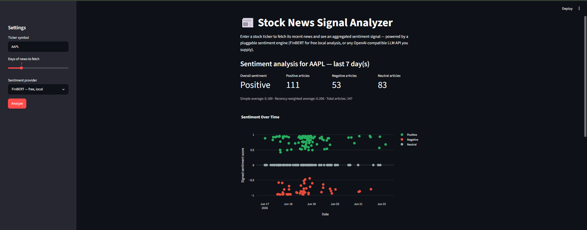
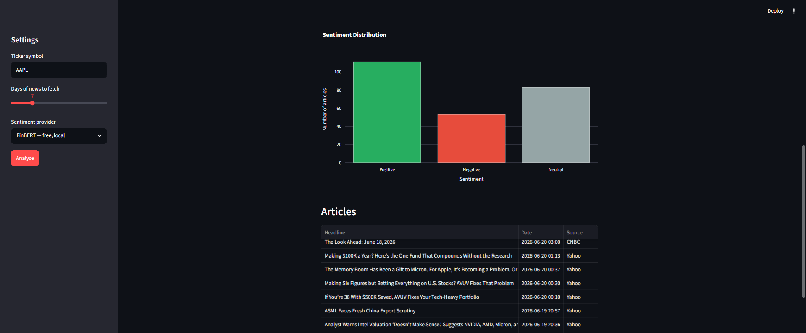
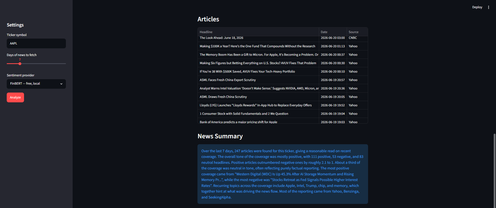

# stock-news-signal-analyzer

This app reads recent news about a stock and tells you whether the coverage has been mostly positive, negative, or mixed.

## What you need

- Python installed (3.10 or newer).
- A free Finnhub API key — sign up at [finnhub.io](https://finnhub.io/) and copy the key from your dashboard.
- That's it for the default mode (FinBERT). No other account or payment is needed.

## How to run it

Clone the project and set up an environment:

```bash
git clone https://github.com/bulut396/stock-news-signal-analyzer.git
cd stock-news-signal-analyzer
python -m venv venv
venv\Scripts\activate        # or: source venv/bin/activate   on Mac/Linux
pip install -r requirements.txt
```

Add your Finnhub key. Copy the example file to a real one:

```bash
cp .env.example .env
```

Open `.env` in a text editor and paste your Finnhub key after `FINNHUB_API_KEY=`. Save the file.

Then start the app:

```bash
streamlit run app.py
```

## What you'll see

In the sidebar you choose a ticker symbol (like `AAPL`), how many days of news to look at, and which sentiment engine to use. Click **Analyze** and the app shows:

- Sentiment cards (overall mood, and how many articles were positive, negative, and neutral)
- A chart of sentiment over time
- A chart of the positive/negative/neutral breakdown
- A table of the articles it found
- A short written summary of what the news was about

## The two sentiment engines

- **FinBERT** — free, runs on your own computer, no extra account needed. This is the default.
- **Custom LLM API** — optional, for people who want to use their own AI provider (such as OpenAI, or any other service with a compatible API). You type in your provider's address, the model name, and your key, and the app sends the news to whichever service you chose. Use this only if you already have an AI provider account.

## First-run speed

The first time you run the app, it downloads a sentiment model (a few hundred MB). Depending on your internet speed this can take several minutes. After that first download the model is saved on your computer and loads quickly on later runs.

## Technical Notes

The Custom LLM option expects an OpenAI-compatible chat completions endpoint, so it works with OpenAI, OpenAI-compatible proxies, and self-hosted servers that follow the same request format. Sentiment scores are combined into a simple average and a recency-weighted average (newer articles count for more).

## License

Released under the [MIT License](LICENSE).

## Screenshots

**Overview — sentiment summary and sentiment over time**



<br><br>

**Sentiment distribution**



<br><br>

**Article table and news summary**


